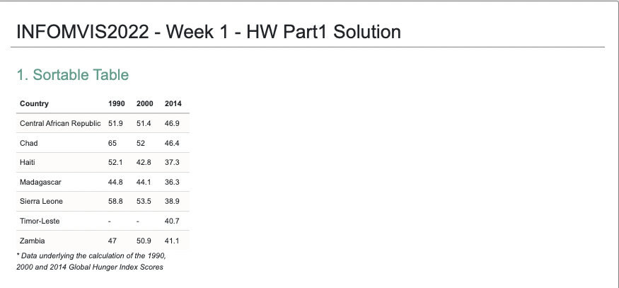

# Week 01 | Homework

*In this homework*, you will create a simple webpage with HTML and CSS.

This homework assumes that you have read Chapter 3 (up to page 36) in *D3 - Interactive Data Visualization for the Web* (Second Edition!) by Scott Murray.

&nbsp;


## Web Development Basics: HTML & CSS


### Data

The following table shows countries with an alarming hunger situation based on the Global Hunger Index (GHI) scores from 1990, 2000, and 2014. The Index ranks countries on a 100-point scale, with 0 being the best score (no hunger) and 100 being the worst.

Country | 1990 | 2000 | 2014
------------ | ------------- | ------------ | ------------
Central African Republic | 51.9	 | 51.4 | 46.9
Chad | 65 | 52 | 46.4
Haiti | 52.1 | 42.8	 | 37.3
Madagascar | 44.8 | 44.1 | 36.3
Sierra Leone | 58.8	 | 53.5 | 38.9
East Timor | — | — | 40.7
Zambia | 47 | 50.9 | 41.1


*The Global Hunger Index (GHI) is designed to comprehensively measure and track hunger globally and by country and region. Calculated each year by the International Food Policy Research Institute (IFPRI), the GHI highlights successes and failures in hunger reduction and provides insights into the drivers of hunger.* (IFPRI, 2015)


### Design and Implementation

Please follow these instructions.

a. **Create a new HTML file `index.html` and a new external CSS file.**

You should give some thought to the organization of the files and folders of your web/visualization projects. Instead of dumping everything in one folder, we suggest the following structure for the beginning:

```
hw/
	index.html
	css/ 		...folder with all CSS files
	js/ 		...folder with all JavaScript files
```

b. **Include your external stylesheet in your HTML file as well as the Bootstrap stylesheet and Javascript bundle**

c. **Start populating your `body` by laying out a grid for your page**


Read through the homework and come up with a reasonable grid for your page. Here's a  of our implementation that might help you to decide on a suitable grid structure. You might have noticed that we kept this hw rather short and simple so that you can focus on key-concepts such as the bootstrap grid system. From now on, we always expect you to create and use a reasonable, accurate, and flawlessly implemented grid system for all your coding projects.

d. **Add a headline to the HTML `body`**

e. **Embed the given table (Global Hunger Index) in HTML**

Please be aware of the different html tags for rows with column names and rows with actual data (i.e., table header, table row). The bootstrap documentation might come in handy: [https://getbootstrap.com/docs/5.1/content/tables/](https://getbootstrap.com/docs/5.1/content/tables/)

f. **Center your elements**

In this homework, we want you to center both the heading and the table. Centering can be achieved through tweaking the parent-child relation between elements. If you have problems centering an element, you should always examine the dimensions and properties of the element you want to center as well as the ones of its parent. Making use of the bootstrap classes ```justify-content-center``` and ```self-align-center``` is one out of various ways to center an element. Here is an example that should be of help. Check it out - but make sure you have bootstrap embedded when you do!
```
<div class="container">
    <div class="row justify-content-center" style="background: green; height: 33.3vh; margin-top: 33.3vh">
        <div class="align-self-center" style="padding: 2vh; background: red">
            <button class="btn btn-dark">I am a button sitting in a red centered DIV</button>
        </div>
    </div>
</div>
```


g. **Add several custom styles to your external CSS file**

You can choose your design parameters freely (i.e., decisions about fonts, colors or scales are up to you) but make sure to include at least:

  - Custom font (e.g. Arial)
  - Custom style for the headline
  - Highlight column names in the table
  - Alternating row colors for the table

*Keeping your CSS rules separate means that you can use styles multiple times and your HTML documents remain clean and understandable.*

h. **Download and include the given JavaScript file `sortable.js` at the bottom of the `body` element.**

[sortable.js](./sortable.js)

Make sure to save the contents of this file as .js file! This script provides some additional functionality and makes your table sortable. Over the course of the semester, you will learn more about integrating interactive components with JavaScript but for this homework, it is fine if you include our given library. Example integration:

```
<script src="js/sortable.js"></script>
```

i. **Add the class name `sortable` to the `table` Element**

If you have implemented everything correctly you should be able to sort the columns by clicking on the column names.

j. **Add a two-column layout below the table**

You should use the empty containers in the following exercise (*Infographic Design Critique*). Add the infographic to the left column and the answers to the questions in part *c* to the right column.

*Please use Bootstrap's [grid-system](https://getbootstrap.com/docs/5.1/layout/grid/), leveraging what you learned in this week's Lab. It is very flexible and will definitely be helpful for future projects.

*As a general rule, only use html `<table>` tags in an html layout to display data that can be well-represented in rows and columns (i.e., tabular data). Do not use it as a general layouting device!*

#### Extra Challenge - Bootstrap Carousel (optional, for fame and glory, not extra points)

If you've finished all the tasks above and want more programming practice, we recommend implementing a slideshow/carousel component. Examine the bootstrap documentation for some helpful sample code. As for the content of the carousel, we'd like you to include your examples for good or bad visualizations in the slideshow. Make sure to use a proper headline for the slideshow.

&nbsp;

## Submit Homework on SURFdrive

**First, create a folder containing a) your homework files b) your lab submission and c) a file where you tell us who your lab partner for this week was (if any). Name your folder appropriately, as shown below and follow our naming conventions and file structure.**

**Next, go to https://surfdrive.surf.nl/files/index.php/s/YBZuicb0FM1uYie > week-01 > HW > submissions and upload submission_week1_FirstnameLastname.zip file to the submission folder.**

****

To upload an entire directory structure please compress your entire local directory into a zip file. Use the following recommended folder structure:

```
/submission_week01_FirstnameLastname
    hw_part1/
        index.html
        css/ 		...folder with all CSS files
        js/ 		...folder with all JavaScript files\
    lab_part1/
    hw_part2/
	    implementation/
   	        index.html
	        css/ 		...folder with all CSS files
	        js/ 		...folder with all JavaScript files\
	
	
    lab_part2/        
	    ...

```
Note that you should add your name to the filename using CamelCase style, e.g., ```submission_week01_JohnDoe.zip``` if your name is John Doe.

**Congratulations on finishing Homework 1! See you in class!**


