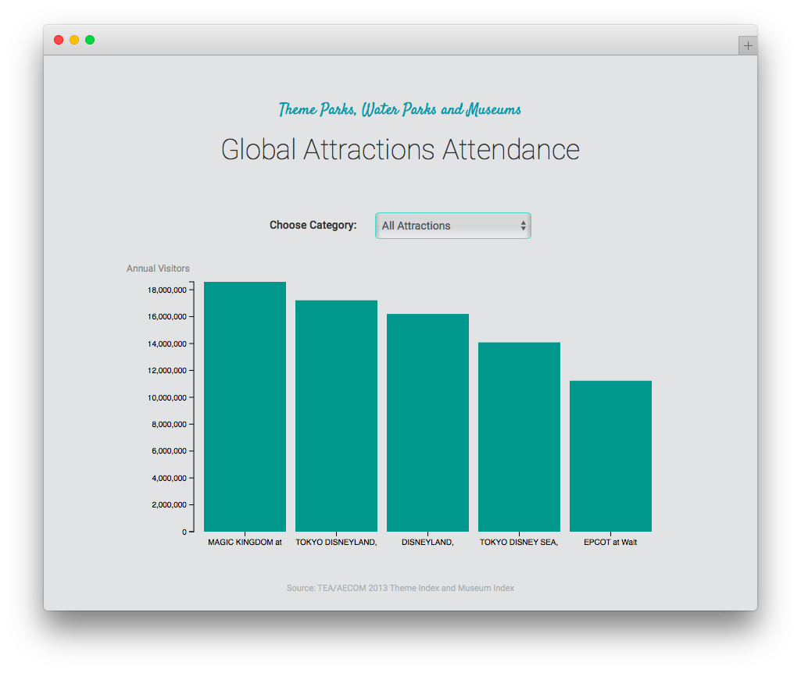
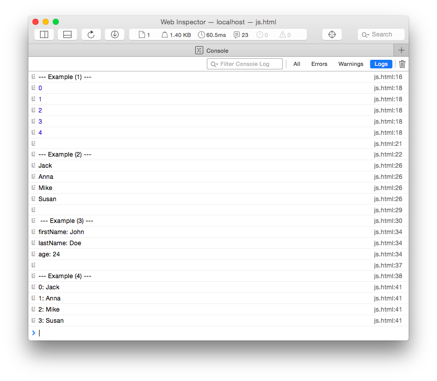
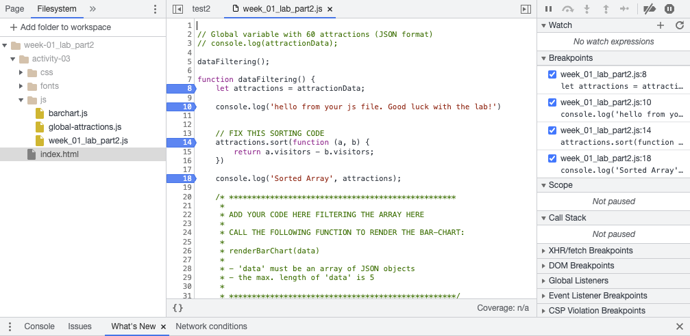
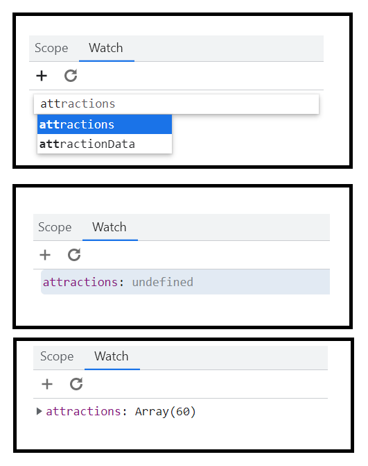
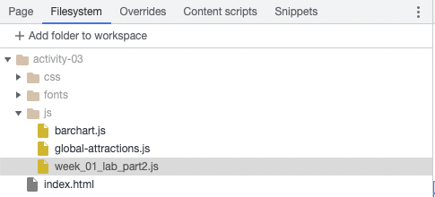
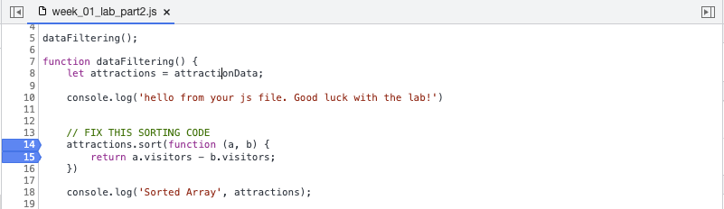

# Week 02 | Lab (24.11.2023)

## Fundamentals of Web Development (JavaScript)

### Introduction


*From now on, and in all upcoming labs and homeworks we will use the common abbreviation JS for the term JavaScript.*

This lab includes three activities and covers JS basics. It is intended to solidify your understanding of JS so that you are able to write your own code in upcoming exercises. If you already know JS well, feel free to skim the text and jump right to the activites. However, if you are new to JS or need a refresher, make sure to read the text closely!

*The result of this lab may look like the following screenshot. Among other things, you will work with data from amusement parks and museums and do some array manipulations and filtering. At the end you will use JS to call a function that will render a pre-configured bar chart.*



### A short reiteration of the basic concepts of JavaScript (JS)

We assume that you have completed the pre-reading on JS, so here we are only showing you some examples and use cases of JS basics.

#### Variables

```javascript
// Variables in JS are loosely typed

// String
let month = "February";

// Integer
let day = 4;

// Double
let temperature = 34.36;

// Boolean
let winter = true;
```


#### Data Structures

##### Arrays
* Arrays can store a sequence of values, and contain any type of data.
* Use bracket notation ```[]``` to define or access an array.

```javascript
// Array with integer values
let numbers = [1, 2, 3, 100, 500, 4];

// Array with strings
let fruits = ["Orange", "Banana", "Apple"];

// Empty array declaration
let names = [];

// Access the elements of an array
fruits[0]; 	// Returns: Orange
fruits[1]; 	// Returns: Banana

// Adding array elements
fruits.push("Mango");	// adds a new element to fruits

// Access the length of an array using the length attribute
let numberOfFruits = fruits.length;

// You can nest arrays (multidimensional)
let nestedNumbers = [[1, 2], [3, 4], [5, 6]];
```

> You can do much more with arrays than shown here. Again, check out the [MDN documentation](https://developer.mozilla.org/en-US/docs/Web/JavaScript/Reference/Global_Objects/Array) if you have no experience with JavaScript or difficulties with some concepts. Arrays are very important for data visualization, so take the time to go through this at home!


##### Objects

* Objects are the second type of compound data types in JS.
* Use curly brackets ```{}``` to define an object and list *properties* and *values*.

```javascript
// JS object with four properties
let course = {
	id: "INFOMVIS2023",
	name: "Visualization",
	students: 30,
	active: true
}

// Accessing an object via dot notation, specifying the name of the property
course.id; 		// Returns: INFOMVIS2023
course.students;	// Returns: 30

// We can include arrays in objects
let course = {
	id: "INFOMVIS2023",
	students: ["Luuk", "Michelle", "Lucas", "Anne"]
};

// And we can also create arrays of objects
let courses = [
	{ id: "INFOMVIS2023", name: "Visualization" },
	{ id: "INFOMPR", name: "Pattern Recognition" }
];

// To access this data we just follow the trail of properties
courses[1].id; 	// Returns: INFOMPR

// Keep in mind: [...] means array and {...} means object!
```

##### JSON (JavaScript Object Notation)

* JSON is a popular data-interchange format for APIs (application program interfaces) and therefore very important for our future tasks.
* It is basically a JS object, with the only difference being that the property names are surrounded by double quotation marks.

```javascript
// JSON object
let course = {
	"id": "INFOMVIS2023",
	"name": "Visualization",
	"students": 30,
	"active": true
}
```

&nbsp;

-----

## Activity I

1. **Use the JavaScript Web Console**

	As we have already learned, there are some developer tools in our web
	 browsers that make programing a bit easier. Normally, we include JS code in HTML files and
	  then open these files in the browser. But we can also use the *Console* to type JS code
	   directy in the browser. We've also provided more information about the console, how to use
	    it as a debugging tool and what's going on underneath the hood [here](####the-console).

	* Open your developer-tools (in your browser) and switch to the tab ***Console***

	* Create a few variables and try out some mathematical operators to see how it works. The console accepts one line of code at a time.

	* Type in the examples below, line by line.

		Examples:

		```javascript		
		(1) let message = "I am learning JS"
		(2) message

		(1) let cities = ["Tokio", "Berlin", "San Francisco"]
		(2) cities[0]
		(3) cities [2]

		(1) let numeric = 12
		(2) numeric / (1 + 2)
		```

	*If you need multiple lines (e.g. JSON object) you can write the code in an editor and copy it into the console. This is an easy and quick way to test out code. Furthermore, the console is an essential tool for debugging. We will give it a try soon, but first continue with step (2).*

2. **JS data structure**

	Now it is your turn to apply your acquired knowledge! Come up with a *proper compound JS data structure* to store the following information and make sure that its values are simple and efficient.

	We have data for **three attractions** in an amusement park that we want to store. Each amusement ride has several attributes:

	- ID
	- Name
	- Price in USD
	- List with opening days (some attractions are open only on specific days, like weekends)
	- Limited access for children (yes / no)


	*You can make up the actual values for each of those attributes. We are mainly interested in the following: How would you store this data in code? Which data structure(s) would you use?  We suggest that you start with pen and paper to design your data structure (or your local code editor). Which JS data structure would you use (basic data types, arrays, objects, etc.)? Which data types (string, boolean, etc.) would you use to represent the data? Once you know how you want to implement it, continue to step (3).*

3. **Create a new HTML file and JS file and implement the data structure**

	JS can be included directly in HTML or in a separate file with *.js* suffix and then referenced. Generally, including JS in a separate file is the preferred method:

	```javascript
	// Included directly
	<script type="text/javascript">
		let message = "test";
	</script>

	// Referenced (at the bottom of the <body> tag, below other included javascript libraries)
	<script type="text/javascript" src="js/myscript.js"></script>
	```

	Make up some example data (3 amusement rides, with the above described attributes) and implement your data structure in JS.

4. **Write messages to the web console**

	The console is an essential tool for debugging. It shows logged security alerts, warnings, errors, informational messages etc. When you are creating scripts, you can write your own debug messages to the console:

	```javascript
	console.log("My debug message");

	let debugId = 12;
	console.log("Another debug message with id: " + debugId);
	```

	Use ```console.log()``` to print some information of your dataset:

	* Name of the first amusement ride
	* All days when the second attraction is open
	* First item of the list of opening days from the second amusement ride
	* There is a 50% discount for your third attraction! Print the reduced price.

&nbsp;

-----


You should already be familiar with **control structures**, **loops** and **functions**. The following just shows some examples and the correct syntax for using those structures.


#### Control Structures & Loops

##### IF-STATEMENT

```javascript
let numericData = 10;

// Regular if statement
if (numericData >= 10) {
	console.log("Equal or greater than 10");
} else if (numericData > 0 && numericData < 10) {
	console.log("Between 0 and 10");
} else {
	console.log("Less than 1");
}

// The ternary operator can be used as a compact alternative to an if-statement
// CONDITION ? WHAT_HAPPENS_IF_TRUE : WHAT_HAPPENS_IF_FALSE
let result = (numericData >= 10) ? "greater than or equal to 10" : "less than 10";
let result = (numericData % 2 === 0) ? "even" : "odd";
```

##### FOR-LOOP

```javascript
// (1) Loop through a block of code 5 times (printing the value of i each time to the console)
for (let i = 0; i < 5; i++) {
	console.log(i);
}

// (2) Loop through each of the values in an array
let arrayWithNames = ["Jack", "Anna", "Mike", "Susan"];
for (let i = 0; i < arrayWithNames.length; i++) {
	console.log(arrayWithNames[i]);
}

// (3) Loop through the properties of an object
let person = { firstName: "John", lastName: "Doe", age: 24 };
for (let property in person) {
	console.log(property + ": " + person[property]);
}


// (4) The holy grail of JS loops:
// makink use of object oriented JS, the forEach loop is an array methode
// that iterates over all elements in the array. The index of the element
// and the element itself are available inside the loop via an anonymous callback function.
// That's definitely a lot to wrap your head around, but once you get used to it, this loop is pure magic.

# # # # # # # # # # # # # # # # # # # # # # # # # # #
arrayWithNames.forEach( (element, index) => {
	console.log(index + ": " + element);
});
# # # # # # # # # # # # # # # # # # # # # # # # # # #
```

*Result:*



#### Functions

Here we list a few examples to show you the syntax for functions. In the following weeks you will learn more about anonymous functions, callbacks etc.

```javascript
// Call a function
toCelsius(34);

// Function (with input parameter and return value)
function toCelsius(fahrenheit) {
	return (5/9) * (fahrenheit-32);
}

// Another function call
console.log("Write something to the web console");

// Function used as a variable
let temperature = "Current temperature: " + toCelsius(34) + " Celsius";
```


> To create a **local variable**, use the keyword ```let```. *Local* refers to the current execution context. When used within a function these variables are **private to that function**, however, when they are declared outside a function they are global.

&nbsp;

-----

## Activity II

*In this exercise you should use your data structure from the previous activity (amusement rides) and add two short functions to the JS file.*

1. **Create a new function: doublePrices()**

	This function takes your data structure as an input variable. You should loop through all the amusement rides, and modify their prices (*2). (Note: You will be modifying the original data here, but that is fine. You do not need to create a deep copy of the data.)

	```javascript
	// Calling the function
	let amusementRidesDouble = doublePrices(amusementRides);

	// Implementation of the function
	function doublePrices(amusementRides) {

		// TODO: Modify data here ...

	}
	```

	You can add a ```console.log(amusementRidesDouble);``` at the end to look at the result of your code.

	> Pro tip: In JS, when you pass a primitive type variable (e.g., string or number) to a function, it is passed by value. On the other hand, if you pass an object, it is passed by reference. To try out the difference, check out this [JSFiddle code snippet](https://jsfiddle.net/ywn5vno5/). If you don't know the difference between pass-by-value and pass-by-reference, don't worry about it for now. But you might want to come back to this eventually.

	&nbsp;

2. **Modify the function doublePrices() to double all prices, except for the second item in your list of amusement rides**

	&nbsp;

3. **Create a second function: debugAmusementRides()**

	In this function, loop through the modified list of attractions and write the **name** and the new **price** for each item to the console.

	```javascript
	// The + operator can be used to concatenate strings/variables.
	let firstName = "John";
	let lastName = "Doe";
	let name = firstName + " " + lastName;

	console.log(name); 	// Returns: John Doe
	```
	&nbsp;

4. **Changing the DOM with JS**

	Now we want to display some attributes of our amusement rides directly on the website, not just the JS console. To do this, we first have to create a new HTML element and then fill the content of this element dynamically with JS.

	The easiest way to modify the content of an HTML element is by using its *innerHTML* property. This implies that you have to create a string for the HTML snippet you want to insert first, and then set the *innerHTML* property. For example, you can create a new string variable and extend it in a for-loop, before you assign it to the *innerHTML property*.

	Here is an example that you can copy and paste into your HTML file:

	```javascript
	<div id="content-1"></div>
	<div id="content-2"></div>

	<script type="text/javascript">
		// Write HTML with JS
		document.getElementById("content-1").innerHTML = '<h1>Headline</h1>...and some text';

		// Loop through array, build HTML block and finally display it on the page
		let fruits = ["Orange", "Banana", "Apple"];
		let result = '';
		for (let i = 0; i < fruits.length; i++) {
			result += fruits[i] + "<br/>";
		}
		document.getElementById("content-2").innerHTML = result;
	</script>
	```
	Note that this example includes the JS code directly in the HTML file. Usually it's preferrable to link to an external javascript file. Try it out!

	Now it's your turn! Update the HTML with the following content:

	* **Add a new HTML element to your document with a specific ID** (e.g. ```div```).
	* **Create a new function** or duplicate debugAmusementRides() that loops through all amusement rides and **displays the name and the new prices on the website**.

&nbsp;

-----


### More JavaScript

Here we introduce some more advanced JavaScript concepts, that will be very important once we start working with D3. Don't worry, we will reiterate over them with more examples in the next labs in connection with D3.


#### Functions are Objects

In JavaScript, functions are objects which can be *called*. They take arguments and they return values. But because of their object-like characteristics, they are also just values that can be stored in variables and passed on.

There is an alternative way of defining functions:

```javascript
// We assign a function to the variable 'message'
let message = function(firstName) {
    return "Hello, I'm " + firstName + ".";
}

// We can call the function to get the expected message
console.log(message("Sarah"));	// Returns: Hello, I'm Sarah.
```
And a more advanced example:

```javascript
let person = { firstName: "Sarah", age: 24, profession: "Student" };

// Add a new variable to the class 'person' called 'message'. Store a function in 'message'.
person.message = function() {
	return "Hello, I'm " + this.firstName + "!";
}
console.log(person); // Returns your new person object

console.log(person.message()); // Returns: Hello, I'm Sarah.
```

In these examples, the current *scope* - the environment in which the function executes in - is important.

> The default scope for executing functions is the *Window Object* which is a browser level object representing the actual browser window/tab. Additionally, we have also used the keyword ```this```. In the global execution context (outside of the function) ```this``` refers to the global object. Inside a function, the value of ```this``` depends on how the function is called.

So that means, if you run the function in the person's scope (second example), you can access the first name via ```this```. If you use ```this.firstName``` in a function by itself (e.g. without the scope of the person object) it will give you an error, because your window object has no attribute ```firstName```.

If this still seems confusing to you, you can read up on this on the [MDN documentation](https://developer.mozilla.org/en-US/docs/Web/JavaScript/Reference/Operators/this). We will also come back to this in later labs.


#### Array Manipulation with higher-order functions

JS offers several functions for fast array manipulation. These functions usually rely on concepts from functional programming and can be hard to grasp at the beginning. We will come back to them in more detail later, but below you find a first introduction.
If you want to read up on higher-order functions, here is a [link](http://eloquentjavascript.net/05_higher_order.html).

The ***filter()*** method creates a new array with the elements that meet a condition implemented by the provided function.

```javascript
// ---- Filter Example 1 - Get all cities except London ----

let cities = ["Vienna", "Paris", "London", "London"];

// Pass a function to cities.filter()
let filteredCities = cities.filter(checkCity);

// Implementation of passed function
function checkCity(value) {
  return value != "London";
}

filteredCities // Returns: ["Vienna", "Paris"]

console.log(filteredCities);


// ---- Filter Example 2 - Get all numbers which are >= 10 and have array indices > 3 ----

let numericData = [1, 20, 3, 40, 5, 60, 7, 80];

// Use an anonymous function in numericData.filter
// (the anonymous function takes the array element's current value and index as parameters)
let filteredNumericData = numericData.filter( (value, index) => {
	return (value >= 10) && (index > 3);
});

filteredNumericData // Returns: [60, 80]
console.log(filteredNumericData);

```

For more information on ***filter()*** you can take a look at [this tutorial](http://adripofjavascript.com/blog/drips/filtering-arrays-with-array-filter.html).


The ***sort()*** method sorts the items in an array. No new array object will be created during execution.

```javascript
// ---- Sort Example 1 - Filter array with strings (default sorting) ----

let cities = ["Vienna", "Paris", "London", "Munich", "Toronto"];
cities.sort();
cities 	// Returns: ["London", "Munich", "Paris", "Toronto", "Vienna"]
console.log(cities);


// ---- Sort Example 2 - Filter array with objects ----
// We are specifying a function that defines the sort order

let products = [
	{ name: "laptop", price: 800 },
	{ name: "phone", price:200},
	{ name: "tv", price: 1200}
];

// Sort ascending by the 'price' property
products.sort( (a, b) => {
	return a.price - b.price;
});

// Sort descending by the 'price' property
products.sort( (a, b) => {
	return b.price - a.price;
});
```
The ***map()*** method creates a new array with the results of calling a provided function on every element of the original array.

```javascript
// ---- Map Example 1 - Calculate the square root ----

let numericData = [1, 4, 9];
let roots = numericData.map(Math.sqrt);

roots	// Returns: [1, 2, 3]


// ---- Map Example 2 - Double the prices ----

let products = [
	{ name: "laptop", price: 800 },
	{ name: "phone", price:200},
	{ name: "tv", price: 1200}
];

let expensiveProducts = products.map(doublePrice);

function doublePrice(elem){
	elem.price = elem.price * 2;
	return elem;
}

expensiveProducts // Returns: [{ name: "laptop", price: 1600 }, { name: "phone", price:400}, { name: "tv", price: 2400}]
```

*You will learn more about other useful array manipulation methods (e.g. ```join()```, ```reduce()```, ...) in our next labs.*


&nbsp;
-----


### Debugging

You've learned about how to use your browser's built-in web developer tools
. However, so far you've only learned how to use these tools to inspect the DOM and analyze the tree
 structure of HTML elements. Today, we want you to start using the **console** as well as the
  **sources** panel of your dev tools. 
   
#### The console 
   
You've already used the console extensively in activity I. Every browser has a debugging console
, which is a command line interface in your browser that can execute snippets
   of code. JavaScript comes with a (window) console object, that allows you to interact with
    this debugging console. The most prominent amongst many [methods](https://www.w3schools.com/jsref/obj_console.asp) is the .log() method that writes a message to the console. The reason why console.log
    () is such a prominent line in JavaScript is because it allows you to double check that your variables and data structures are indeed
       what you expect them to be - you can think of it like a sanity-check print-statement in
        python. 
     
#### The sources panel 

While for smaller architectures, it is very often more practical to use console.log()
 to debug your code and get to the root of your bug, there is a much more powerful tool that
  comes with the dev tools, which is particularly helpful when you first need to get an overview
   and don't know where to start debugging. In your sources panel, you cannot only view files
   , but i.a. also pause and explore your code using breakpoints and use **watch** to track
    how variables change and get updated while running through your code breakpoint by breakpoint.




How to get set up breakpoints and explore using watch:
- first, go to the sources panel
- then open the js file that contains the code you want to debug (by clicking on it)
- next, click on the line number where you would want to place a break - a blue arrow will appear
 (see screenshots)
- set as many stops as you want/as necessary
- reload the page
- Your debugger is now running. A message in a yellow box overlaying your browser window saying
 "Paused in debugger" is indicating that. Also, the navigation arrows of your breakpoint tool are
  now no longer grayed out and ready to be used
 - next, you can either use the scope tab to explore the behavior of all local and global
  variables while going through the breakpoints or
- you could switch to the **Watch** tab and just name the variables you want to monitor
- in order to watch just the variables you're interested, you can just start typing the name of the
 variable and the dev tools will autocomplete the name (see screenshots)
- the listed variables will now reflect the state of the webapp at the particular breakpoint.




-----

## Activity III

This activity summarizes most of the learned concepts of the first two labs. It includes different aspects of HTML, CSS and JS and will result in a bar chart visualization.

We will provide a template with a basic *HTML structure*, a *dataset* (stored in a JSON array) and a *complete JS function* that renders a bar chart with D3. Your primary tasks are data filtering and controlling the workflow. In the following labs we will introduce D3 and show you how to create these visualizations yourself.

**Data:**

- The dataset (provided with the code template) consists of 60 attractions around the world. Each attraction has the following properties:
	-  ```Location``` *(name, city and country)*
	-  ```Category``` *(theme park | water park | museum)*
	-  ```Visitors``` *(annual visitors in 2013)*
	-  ```Entry``` *(paid | free)*
- The JSON array with objects is stored in the global variable ```attractionData```.
- Data Source: TEA/AECOM 2013 Theme Index and Museum Index

1. **Download template for 'week01_lab_part2 js', unzip it and open it as a new project in Webstorm:**

	[download week-02_lab_part2.zip](./week-02_lab_part2.zip)

2. **Familiarize yourself with the provided HTML document: ```index.html```**

	Look at the source code, its HTML elements, and which files (JS, CSS) are included.

3. **Array sorting and using the Chrome DevTools**

	Open the JS file ```week02_lab_part2.js``` (*js* folder). Most of the tasks you need to complete should be implemented in the function: *dataFiltering()*.

	We have included a template of the function, and have created a local variable ```attractions``` from the global variable and we have called the function right before. You should work with the local variable ```attractions``` - don't override the global one.

	In this exercise we're interested in finding the attractions with the most visitors. We've added some code that sorts the ```attractions``` array by the number of advisors. However, if you look at the console log that prints the sorted array, you'll notice that the sorting isn't working.

	**We'll use the Chrome DevTools to debug this issue.**
		
	- Open the Chrome Developer Tools pane (View -> Developer -> Developer Tools)
	- Click on the `Sources` tab . You'll notice that the HTML/JS/CSS files you're currently
	 working on are listed here. 
	 - Click on the ***week02_lab_part2.js*** file.
        

	- From this file view, we are able to set [breakpoints](https://developer.chrome.com/docs/devtools/javascript/breakpoints/) that let you step through your code as it executes, which is an incredibly powerful debugging tool. **Add breakpoints on lines 14 and 15 as shown below and refresh the page.**
        

	- You'll notice now that your code stops executing at line 14. If you hover over the
	 ```attractions```, you can view the value assigned to the variable.
	- If you press the blue resume button, you'll see that the execution jumped down to line 15
	, which is the next breakpoint. By hovering over ```a.visitors``` you can see that the value is undefined. This is our bug.
	- You can also step forward line-by-line, disable all breakpoints, and step into, out of, and
	 over functions through the buttons at the top right of the debugger by the resume button.
	- If you switch to the Console tab and type in ```a``` and pressing enter, you'll notice you
	 can also interact with the local variables from the console. This is a good tool for testing out code without having to reload the page.
	- From the current value of ```a``` or ```b```, you'll notice there's a property that holds
	 the number of visitors that's capitlized slightly differently than it is in line 15. This is the bug!
	- Disable your breakpoints by clicking on them. Now go back to WebStorm and update your code
	  so that visitors is capitalized correctly. When you refresh the page the log that prints the array should show that it's sorted.

4. **Filter the array**
	We want to show the *top five global attractions* with the most annual visitors in a bar chart. There are 60 attractions in the dataset, so you have to create a new array or modify the variable ```attractions```. *Suggestion: Filter your sorted array to get the first five rows.*

5. **Call the function: renderBarChart(attractions)**

	- This function will automatically render a bar chart with the top attractions in the div-container with the id: ```#chart-area```.
	- You must include a JSON array with attractions as a parameter (array length: 5)
	- If there is a problem, check the web console and try to debug your code (e.g., by using ```console.log()``` statements)
	- If you are still in class, don't hesitate to ask TFs for help! Otherwise, you can use Piazza or office hours!

6. **Extend array filtering**

	As you might have seen already, there is a *select-box* in the HTML document. You can select different categories but right now, nothing happens.

	In the next task you should call a function *dataManipulation()* if someone changes the select-box and then, inside the function, filter the attractions by the selected category:

	* Add the attribute ```onchange="dataManipulation()"``` to the select-box (in the HTML file). The function ```dataManipulation()``` will be automatically called whenever the user changes the value of the select box. However, you will need to create that function!
	* In your JS file you can use the following code snippet to get the selected category. Make sure to change "SELECT-ID" to the ID of the select-box.

		```javascript
		let selectBox = document.getElementById("SELECT-ID");
		let selectedValue = selectBox.options[selectBox.selectedIndex].value;
		```
		Make sure this part is working, by printing out *selectedValue* in the console whenever the select-box selection has changed, before continuing.

	* Before searching for the top attractions and calling *renderBarChart()*: check if the selected category is "all", otherwise filter the attractions by category.

	*If everything has been configured correctly, the bar chart will be updated automatically after selecting a category.*

&nbsp;

-----

#### Bonus Activity (optional!)

- **Add custom styles (CSS)**

	We have included *Bootstrap* and a couple of CSS rules to style the bar chart. Add a new stylesheet or modify ```style.css``` to create an individual design.
	To change the style of the D3 components you will have to add new elements to your css. D3 uses ```<svg>``` tags in the DOM, and you might want to look up properties like *fill* or *stroke*. We've also provided code for you to implement hover interactions in the form of a tooltip, which is classed ```tooltip``` in the DOM. In order to enable this functionality, you must add a placeholder div of id ```tooltip``` to your HTML file. Inside your newly minted div, create a span of id ```value```. We encourage you to play around with adding more content to the tooltip, as well as changing the tooltip's styling in CSS.
&nbsp;

-----

In the last activity you have implemented a function which reacts to the user input (changing a select-box value) and updates the chart immediately. So that means, you have done everything, apart from drawing the bars, to create an interactive data visualization. Next week, we will start with the JS library D3 and you will learn how to draw these SVG charts yourself.
&nbsp;

-----

#### Submission of lab

Congratulations, you have now completed all activities of the first Lab.

*See you next week!*

Please include the code of your completed activity 3 in your homework submission. Read the homework
 documentation for more detail.

&nbsp;

-----


**Resources**

- Chapter 3 (p. 36-52) in *D3 - Interactive Data Visualization for the Web* (Second Edition) by Scott Murray
- [https://developer.mozilla.org/en-US/docs/Web](https://developer.mozilla.org/en-US/docs/Web)
- [http://dataviscourse.net/2015/lectures/lecture-javascript/](http://dataviscourse.net/2015/lectures/lecture-javascript/)
- [http://hangar.runway7.net/javascript/guide](http://hangar.runway7.net/javascript/guide)


